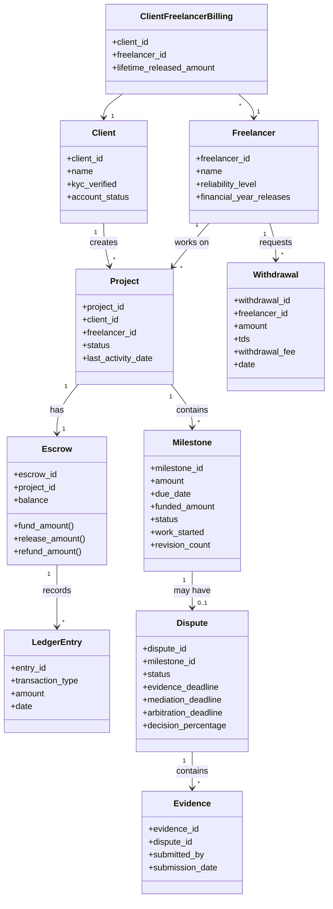

# CLASS DIAGRAM

**Project:** Freelance Marketplace Escrow, Milestone Release, Dispute and Fee-Tier Engine

## Class Diagram

```mermaid
classDiagram

class Client {
    +client_id
    +name
    +kyc_verified
    +account_status
}

class Freelancer {
    +freelancer_id
    +name
    +reliability_level
    +financial_year_releases
}

class Project {
    +project_id
    +client_id
    +freelancer_id
    +status
    +last_activity_date
}

class Milestone {
    +milestone_id
    +amount
    +due_date
    +funded_amount
    +status
    +work_started
    +revision_count
}

class Escrow {
    +escrow_id
    +project_id
    +balance
    +fund_amount()
    +release_amount()
    +refund_amount()
}

class LedgerEntry {
    +entry_id
    +transaction_type
    +amount
    +date
}

class Dispute {
    +dispute_id
    +milestone_id
    +status
    +evidence_deadline
    +mediation_deadline
    +arbitration_deadline
    +decision_percentage
}

class Evidence {
    +evidence_id
    +dispute_id
    +submitted_by
    +submission_date
}

class Withdrawal {
    +withdrawal_id
    +freelancer_id
    +amount
    +tds
    +withdrawal_fee
    +date
}

class ClientFreelancerBilling {
    +client_id
    +freelancer_id
    +lifetime_released_amount
}

Client "1" --> "*" Project : creates
Freelancer "1" --> "*" Project : works on
Project "1" --> "*" Milestone : contains
Project "1" --> "1" Escrow : has
Escrow "1" --> "*" LedgerEntry : records
Milestone "1" --> "0..1" Dispute : may have
Dispute "1" --> "*" Evidence : contains
Freelancer "1" --> "*" Withdrawal : requests
ClientFreelancerBilling "*" --> "1" Client
ClientFreelancerBilling "*" --> "1" Freelancer
```